# RentNest — Frontend
Find & list rental properties with ease — the web client for a rental property marketplace.

| | |
|---|---|
| **Live App** | https://rent-nest-frontend-brown.vercel.app |
| **Backend API** | https://rent-nest-backend-green.vercel.app |
| **Frontend Repo** | https://github.com/TutulMajumder/RentNest_Frontend |
| **Backend Repo** | https://github.com/TutulMajumder/RentNest_Backend |
| **Admin login** | `admin@rentnest.com` / `admin123` |

---

## Table of Contents

- [About the Project](#about-the-project)
- [Project Overview](#project-overview)
- [Screenshots](#screenshots)
- [Key Features](#key-features)
- [Tech Stack](#tech-stack)
- [Dependencies](#dependencies)
- [Installation & Setup](#installation--setup)
- [Folder Structure](#folder-structure)
- [Deployment](#deployment)
- [License](#license)
- [Contact](#contact)

---

## About the Project
RentNest is a responsive **Next.js (App Router)** application for a rental property marketplace. It consumes the RentNest REST API. Tenants browse and filter listings, submit rental requests, and pay securely with Stripe once approved. Landlords list properties, set availability, and approve or reject requests from a dedicated dashboard. Admins moderate users, listings, and rental activity across the platform. Every route is protected by the authenticated user's role using **Next.js Middleware**, and the UI adapts its navigation, dashboards, and actions to whoever is signed in.

---

## Project Overview
Three roles share one client, each scoped to their own permissions:

- **Tenant** — browse/search properties, submit rental requests, pay via Stripe once approved, leave a review after a completed rental, manage their own profile.
- **Landlord** — create/update/remove property listings, toggle availability, approve or reject rental requests (with optimistic UI), view reviews on their properties.
- **Admin** — view and ban/unban users, moderate all properties and rental requests, manage property categories, monitor platform-wide statistics.

Rental request lifecycle:
```
PENDING → APPROVED/REJECTED → (Stripe payment) → ACTIVE → COMPLETED → (review)
                                              ↳ (payment fails) → CANCELLED
```

Users select their role (Tenant / Landlord) at registration. The admin account is seeded by the backend.

---

## Screenshots

### Public & Auth
| | |
|---|---|
| 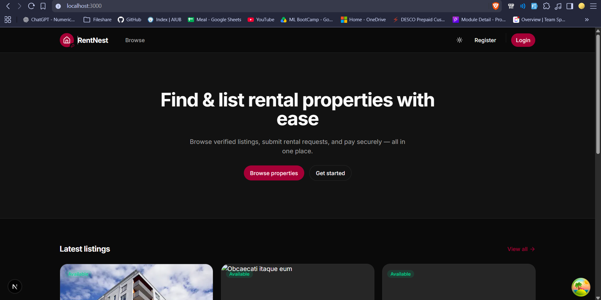 | **Home** — hero, dark/light theme toggle, and the latest available listings. |
| 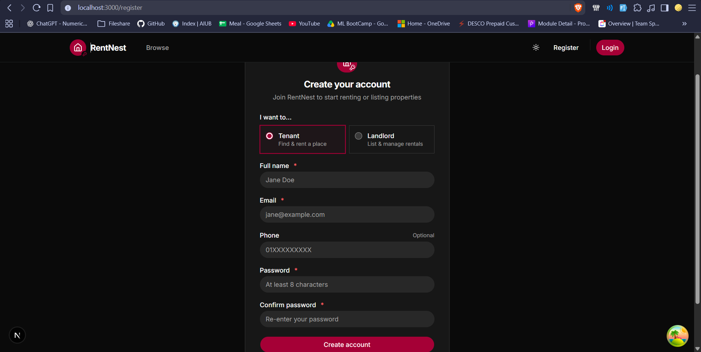 | **Register** — role selection (Tenant / Landlord) with inline, per-field validation. |
| 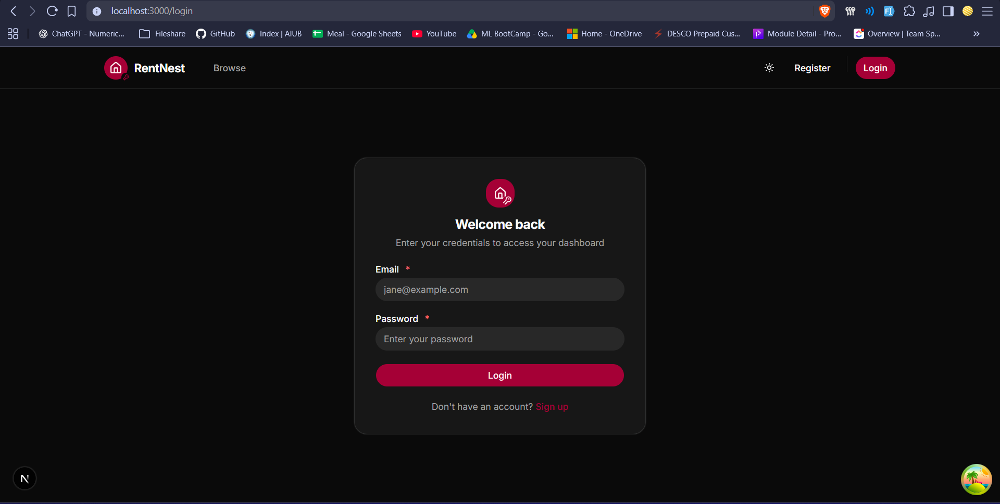 | **Login** — email + password with validation; JWT stored in httpOnly cookies. |

### Tenant
| | |
|---|---|
| 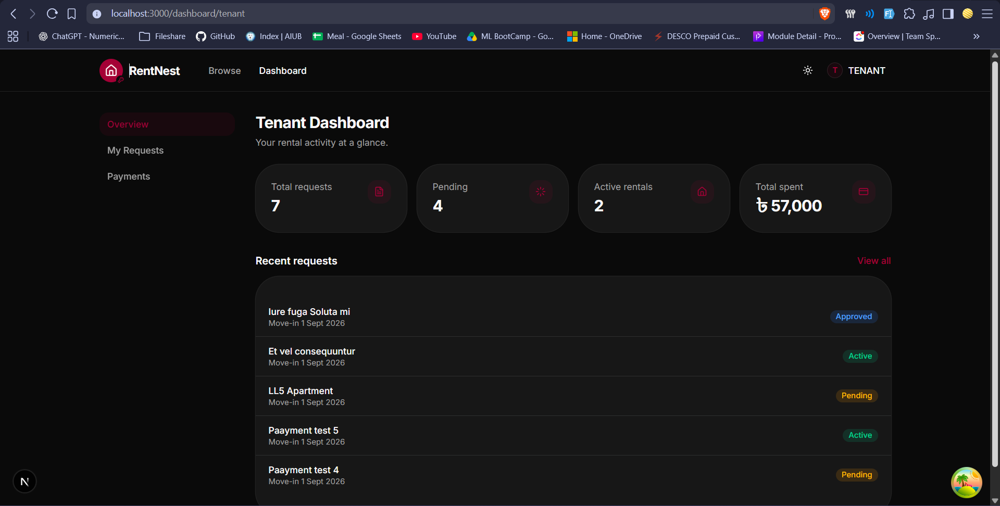 | **Dashboard** — request / pending / active / total-spent stats and recent activity. |
| 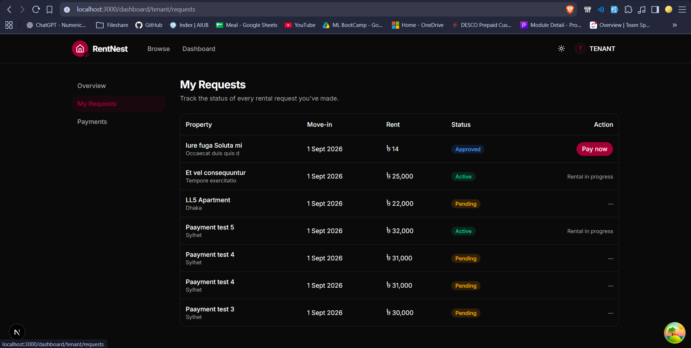 | **My Requests** — status badges; "Pay now" appears the moment a request is approved. |
| 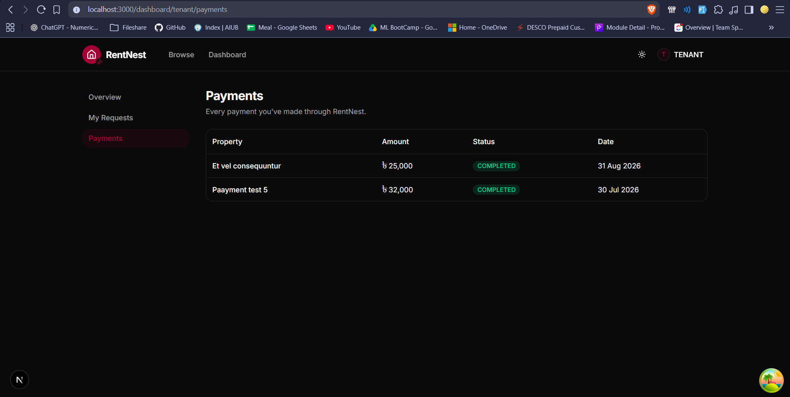 | **Payments** — full payment history with status and date. |
| 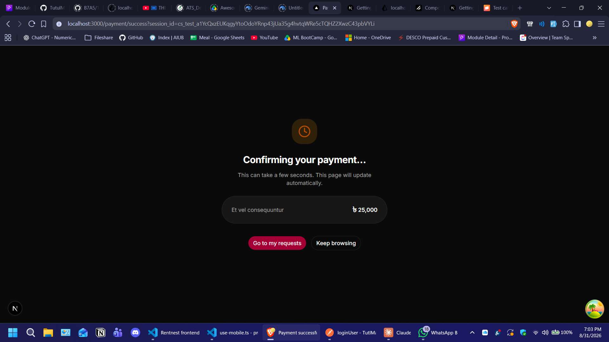 | **Payment return** — verifies the Stripe session on return and updates the UI. |

### Landlord
| | |
|---|---|
| 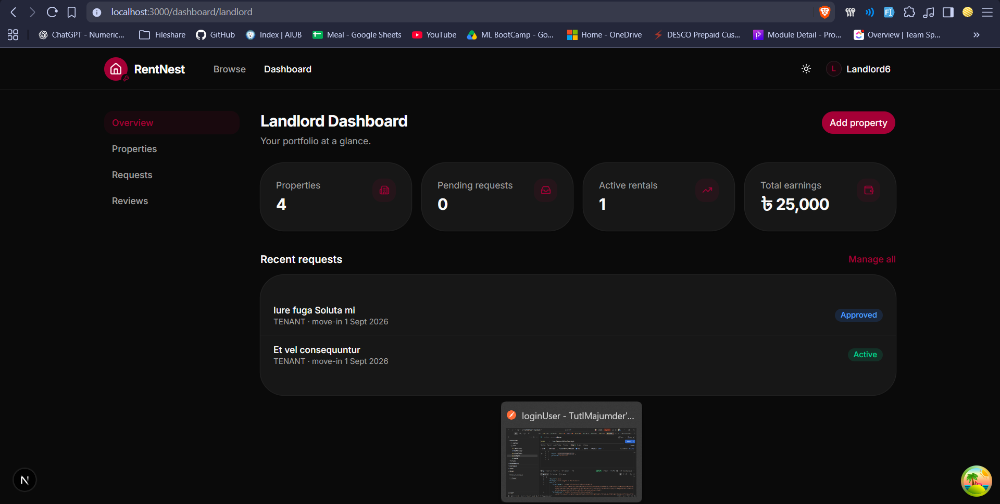 | **Dashboard** — properties, pending requests, active rentals, and total earnings. |
| 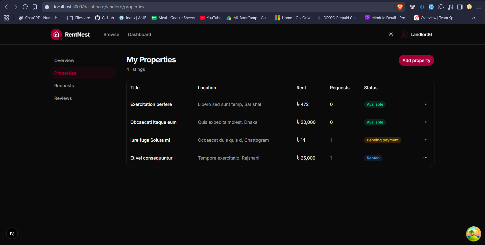 | **My Properties** — availability badges, request counts, edit / toggle / delete actions. |
| 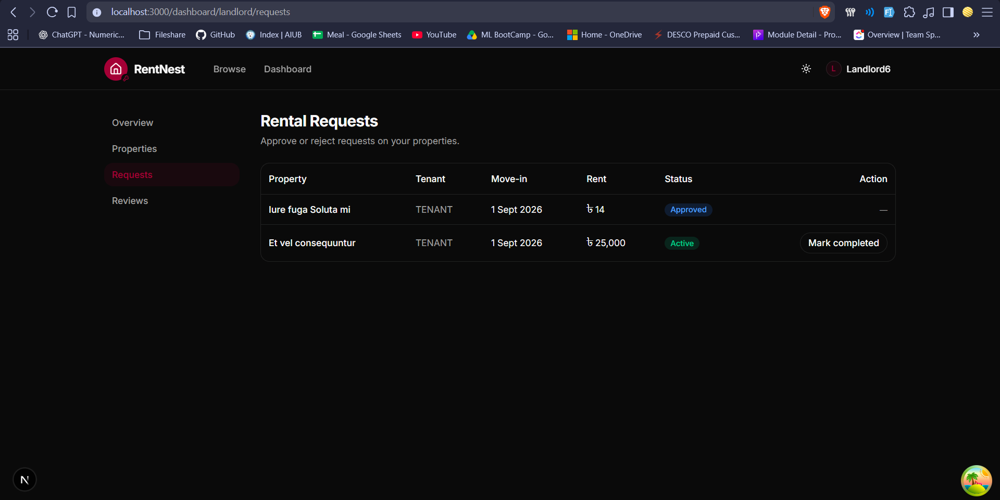 | **Rental Requests** — approve / reject / mark-completed with optimistic updates and toasts. |
| 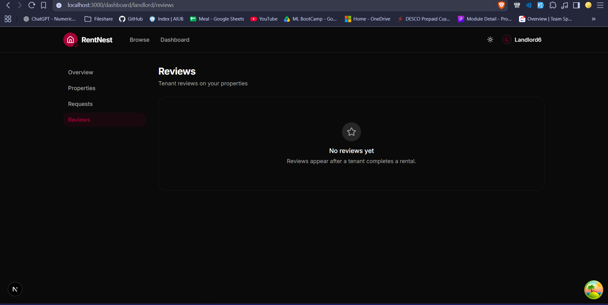 | **Reviews** — tenant reviews across all properties with an empty-state fallback. |

### Admin
| | |
|---|---|
| 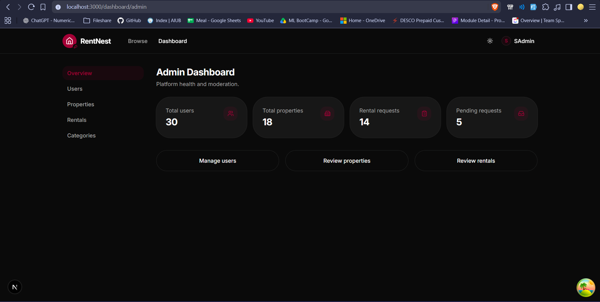 | **Dashboard** — platform-wide user, property, and rental-request counts. |
| 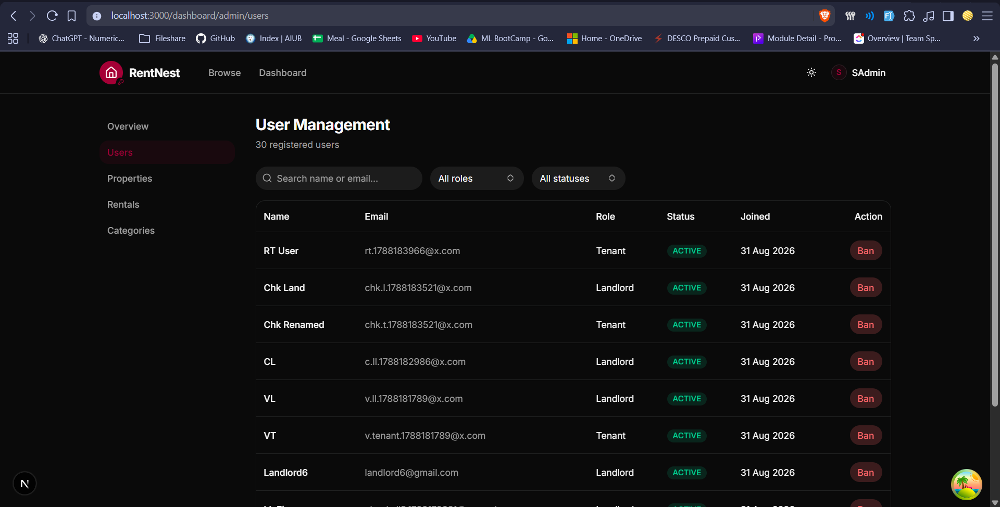 | **User Management** — search, role/status filters, and ban / unban actions. |
| 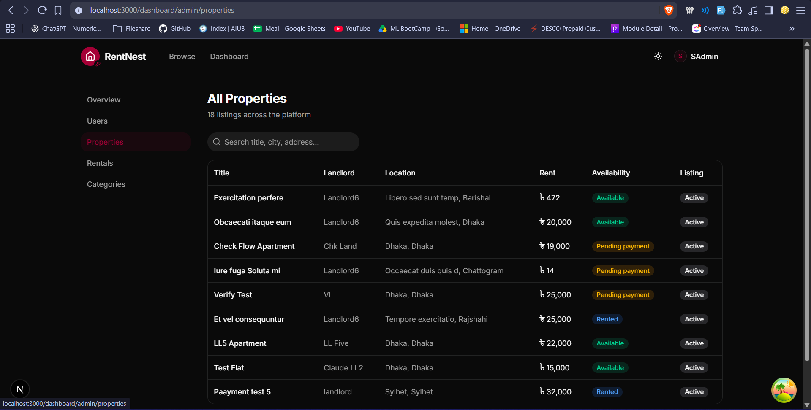 | **Property Moderation** — every listing with landlord, location, and availability. |
| 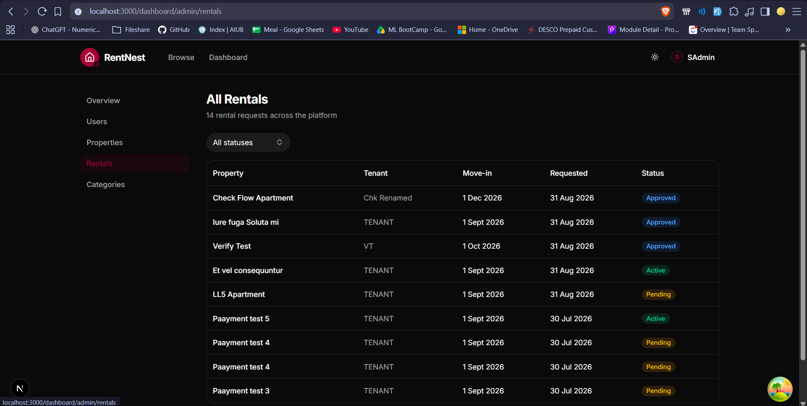 | **Rental Moderation** — every rental request across the platform, filterable by status. |
| 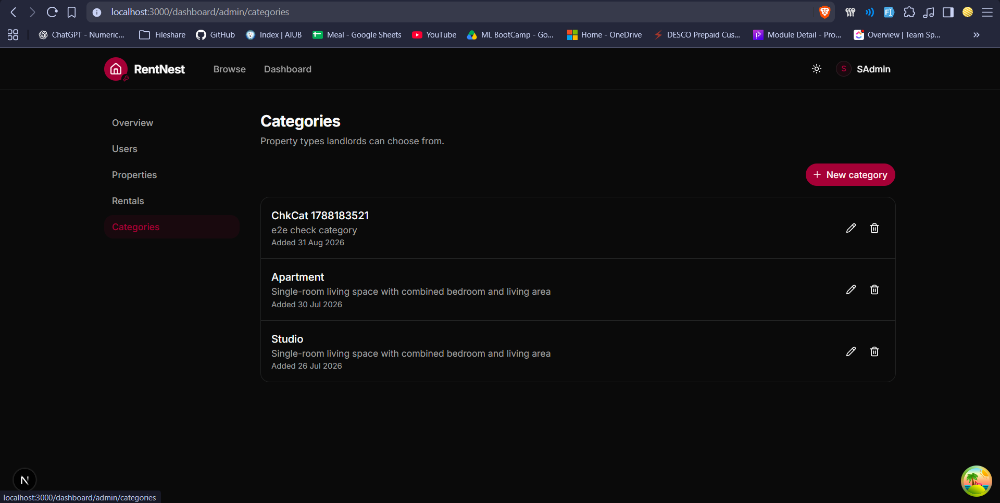 | **Categories** — property types landlords can choose from, with edit / delete. |
| 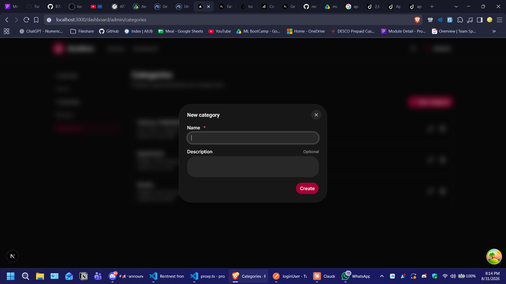 | **Category form** — create / edit categories in a validated modal. |

### Error handling
| | |
|---|---|
| 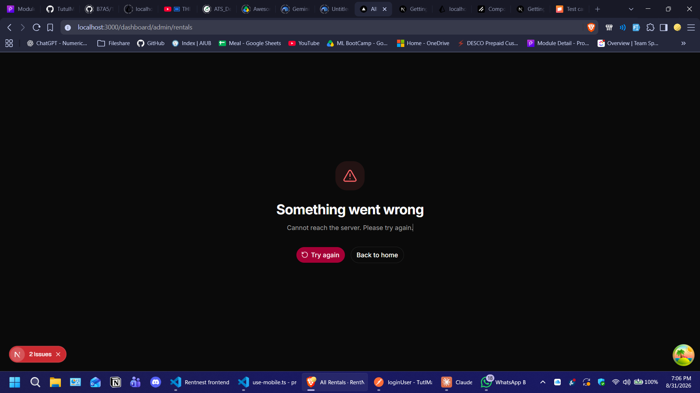 | **Error boundary** — API failures render a friendly retry screen instead of a crash. |

---

## Key Features
- **Authentication** — registration with role selection, login, JWT stored in **httpOnly cookies**, and **silent access-token rotation** using the refresh token inside middleware
- **Route protection (RBAC)** — `proxy.ts` middleware verifies the JWT and gates every `/dashboard/*` route by role; unauthenticated users are redirected to login with a `?next=` return path
- **Property discovery** — responsive grid with `next/image`, URL-driven advanced filters (search, division, category, price range, bedrooms, amenities), pagination, and skeleton loaders
- **Rental request flow** — validated modal form; approved requests surface a "Pay now" call-to-action
- **Payments** — **Stripe Checkout** redirect with a success page that verifies the session directly with Stripe on return (works even when the webhook is delayed) plus a dedicated cancel page
- **Landlord tools** — full property CRUD with an image-URL list and amenities picker; incoming-request table with **optimistic** approve / reject via TanStack Query (rollback on error)
- **Admin tools** — user management (search, filter, ban/unban), content-moderation tables, category CRUD
- **State & data** — Server Components + Server Actions for reads/mutations, TanStack Query for interactive lists, Zustand for the session store
- **UX** — dark / light mode, toast notifications, inline form errors, graceful `error.tsx` / `not-found.tsx`, mobile navigation, loading skeletons
- **Consistent error handling** — one typed API client normalizes every backend response and `ApiError`; errors surface as toasts, inline field errors, or error boundaries
- Frontend-to-endpoint mapping documented in [`API_INTEGRATION.md`](./API_INTEGRATION.md)

---

## Tech Stack
**Framework:** Next.js 16 (App Router · Server Components · Server Actions) · React 19 · TypeScript
**Styling:** Tailwind CSS v4 · shadcn/ui · lucide-react
**Data & State:** TanStack Query · Zustand · Server Components / Server Actions
**Forms & Validation:** React Hook Form · Zod
**Auth:** Custom JWT — httpOnly cookies + Next.js Middleware (`proxy.ts`)
**Payments:** Stripe Checkout (redirect flow)
**Notifications:** Sonner · **Theme:** next-themes
**Deployment:** Vercel

---

## Dependencies
```json
{
  "@hookform/resolvers": "^5.9.1",
  "@tanstack/react-query": "^5.102.8",
  "@tanstack/react-query-devtools": "^5.102.8",
  "class-variance-authority": "^0.7.1",
  "clsx": "^2.1.1",
  "date-fns": "^4.4.0",
  "jsonwebtoken": "^9.0.3",
  "lucide-react": "^1.35.0",
  "next": "16.3.0",
  "next-themes": "^0.4.6",
  "radix-ui": "^1.6.7",
  "react": "19.2.8",
  "react-dom": "19.2.8",
  "react-hook-form": "^7.87.0",
  "server-only": "^0.0.1",
  "sonner": "^2.0.8",
  "tailwind-merge": "^3.6.0",
  "tailwindcss": "^4",
  "zod": "^4.5.4",
  "zustand": "^5.0.15"
}
```

---

## Installation & Setup

1. Clone the repo and install dependencies:

```bash
git clone https://github.com/TutulMajumder/RentNest_Frontend
cd RentNest_Frontend
pnpm install
```

2. Set up environment variables by creating a `.env` file in the root directory (see `.env.example` for the full list):

```env
BACKEND_API_URL=http://localhost:5000
NEXT_PUBLIC_BACKEND_API_URL=http://localhost:5000

# Must match the backend's secrets character-for-character —
# proxy.ts verifies the access token AND the refresh token with these.
JWT_ACCESS_SECRET=your_backend_jwt_access_secret
JWT_REFRESH_SECRET=your_backend_jwt_refresh_secret
```

> The backend's `APP_URL` must point at this frontend's origin — Stripe builds its
> success/cancel redirect URLs from it (`/payment/success`, `/payment/cancel`).

3. Run the application in development mode:

```bash
pnpm dev
```

Open [http://localhost:3000](http://localhost:3000).

4. Build and run in production mode:

```bash
pnpm build
pnpm start
```

5. Test account: use the seeded admin `admin@rentnest.com` / `admin123`, or register a Tenant / Landlord from the UI.

---

## Folder Structure

```plaintext
rentnest_frontend/
│
├── proxy.ts                       # middleware: JWT verify + refresh rotation + RBAC
├── app/
│   ├── layout.tsx                 # providers (Query, Theme), Toaster, fonts
│   ├── error.tsx / loading.tsx / not-found.tsx
│   ├── (public)/                  # home, /properties, /properties/[id]
│   │   └── properties/
│   │       ├── _actions/          # createRentalRequestAction
│   │       └── _components/       # filters, gallery, request-to-rent
│   ├── (auth)/                    # /login, /register
│   │   ├── _actions/              # loginAction, registerAction
│   │   └── _components/           # LoginForm, RegisterForm, AuthCard
│   ├── (dashboard)/               # role dashboards behind the middleware guard
│   │   ├── layout.tsx             # sidebar shell
│   │   ├── _actions/              # property / payment / review / admin / profile actions
│   │   ├── _components/           # forms, tables, dialogs
│   │   └── dashboard/{tenant,landlord,admin,profile}/
│   ├── payment/{success,cancel}/  # Stripe return pages
│   └── api/landlord/requests/     # BFF route handlers for the optimistic table
│
├── components/
│   ├── ui/                        # shadcn primitives
│   └── shared/                    # navbar, tables, badges, filters, cards, skeletons
│
├── service/                      # server-side data functions + api-client + refreshToken
├── hooks/                        # TanStack Query hooks
├── lib/                          # types, constants, validations, utils, query-keys
├── providers/                    # QueryProvider, ThemeProvider
├── stores/                       # Zustand auth store
├── Images/                       # screenshots
├── API_INTEGRATION.md
├── .env.example
├── next.config.ts
├── tsconfig.json
└── package.json
```

---

## Deployment

Deployed on **Vercel**:

1. Import the repository (framework preset: **Next.js**).
2. Add the four environment variables from step 2 above (production values).
3. Deploy, then set the backend's `APP_URL` to the resulting Vercel URL and redeploy the
   backend so Stripe redirects resolve correctly.

---

## License
Distributed under the MIT License.

---

## Contact

**Live App:** [rent-nest-frontend-brown.vercel.app](https://rent-nest-frontend-brown.vercel.app)
**Backend API:** [rent-nest-backend-green.vercel.app](https://rent-nest-backend-green.vercel.app/)
**GitHub:** [TutulMajumder](https://github.com/TutulMajumder)
**Email:** [majumder.tutul.364@gmail.com](mailto:majumder.tutul.364@gmail.com)
**Portfolio:** [Portfolio](https://tutul-portfolio.vercel.app/)
